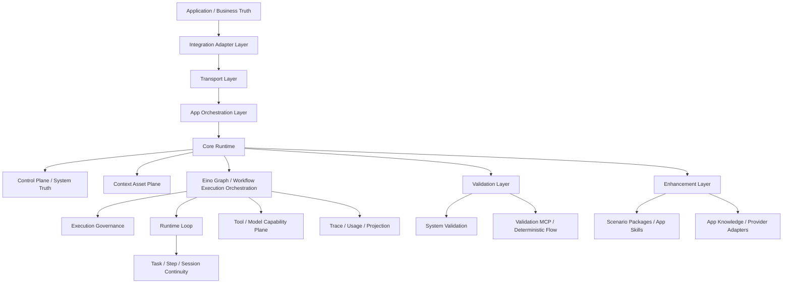

# 通用 AI Agent Platform Runtime 目标架构

## 1. 文档范围

本文描述 Athena 作为通用 AI Agent Platform Runtime 的目标架构、核心分层和长期边界。

当前需要回答的问题是：

- Athena 作为可嵌入上层应用的 agent 平台 runtime，核心内核应该稳定承接什么
- Core / Validation / Enhancement / Application Business Truth 四层边界应该如何划分
- 场景包、系统资产、工作流、技能和工具治理应该放在哪一层
- 外部平台接入应该如何进入 Athena，而不把平台语义写死在内核里
- waiting / resume、tool-call loop、candidate update、audit / rollback 应如何组织

本文不逐条描述当前代码已实现的细节；当前实现以 `implementation.md` 为准。

## 2. 架构目标

Athena 的目标不是某一个具体业务场景的聊天后端，而是一个可被上层应用挂载、编排和治理的通用 Agent Runtime。

它的长期能力分为四层：

- `Core`
  - runtime、task / step、tool execution、governance、trace、usage、sandbox boundary、system truth、projection 基础能力。
- `Validation`
  - System Validation、验证型 MCP server、deterministic validation flow 等独立验证能力。
- `Enhancement`
  - 用户 skill、应用知识库、业务 workflow、场景包、provider adapter、应用 runtime 判断逻辑等可选增强能力。
- `Application / Business Truth`
  - 业务对象、业务规则、业务状态和最终业务真相；默认属于应用层，可通过 enhancement 选择 Athena-managed 或 app-managed 模式。

它长期要稳定提供的能力包括：

- 统一承接聊天、事件、任务和工作流步骤等不同入口
- 把输入归一化为一致的任务语义模型
- 消费结构化上下文资产，而不是依赖某个平台的专有主数据格式
- 在能力声明、执行治理、上下文保留和结果交付之间维持稳定边界
- 支持 waiting / resume、补数请求、工具调用、多轮执行和恢复继续
- 提供可审计、可版本化、可回滚的 system truth 与 control-plane
- 提供通用的结果封装、SSE 过程流和结构化交付面

安全不再是产品本体定义，而是第一套已验证的领域场景包。外部平台接入也不再是架构中心，而是通过适配层表达的可选能力。

## 3. 核心分层

### 3.1 Integration Adapter Layer

这一层负责把外部平台、业务系统或宿主应用的请求映射成 Athena 能理解的统一契约。

它负责：

- 上游请求字段映射
- 上游上下文到 `global_context` / `context_assets` 的映射
- Athena 结果到宿主系统动作、提示或回写格式的映射

它不负责：

- 改写 Athena 内核语义
- 把某个平台的专有字段扩散到核心运行时

当前外部平台接入属于适配层，而不是 Athena 的产品定义中心。

### 3.2 Transport Layer

负责：

- HTTP / SSE 协议承接
- 请求与响应编解码
- resume token、supplement、stream 事件的对外协议表达

Transport 只处理协议，不承载领域推理。

### 3.3 App Layer

负责：

- 请求归一化入口
- 会话打开与恢复
- runtime path / fast path / direct path 选择
- 在 control-plane、context assets 和 runtime 之间完成装配

App 是运行时编排层，不是领域逻辑中心。

### 3.4 Control Plane Layer

负责：

- scene / skill / tool / governance / runtime config / tool governance policy 的可调视图
- system truth、system resource、版本快照、审计和回滚
- tool governance effective policy 与 decision log 的控制面验收视图
- 最小登录、锁定状态和控制台 contract

它不负责：

- 承担外部平台主数据真源
- 放开无边界的核心参数修改

### 3.5 Context Asset Plane

这是 Athena 的长期输入面，用于统一承载：

- persona
- agent profile
- user profile
- memory view
- rule spec / policy rule
- contract
- workflow
- skill / skill bundle / skill summary
- 由上游应用注入的其他可治理资产

这一层应当场景无关、平台无关。领域差异通过资产内容体现，而不是通过核心代码分叉体现。

### 3.6 Capability Plane

负责声明 Athena 能做什么，包括：

- 技能
- 工具
- 交付物写入
- 只读资源读取
- 结构化解析
- runtime 状态查询

能力本身是通用能力；是否允许使用，由治理层决定。

### 3.7 Execution Governance Layer

负责在 capability 和真正执行之间做统一判断：

- allow / ask / deny
- degrade / sandbox
- side-effect 级别限制
- fact quality / policy checkpoint

治理语义不能散落在单个 skill、tool 或 adapter 中。

### 3.8 Session & Continuity Plane

负责：

- session 连续性
- waiting / resume
- deferred queue
- context asset bindings
- candidate asset update
- compact / restore / audit

Athena 不是一次性问答器，而是带状态的代理运行时。

### 3.9 Delivery Plane

统一输出：

- answer
- structured_result
- progress_step / done
- action / candidate update
- artifact write
- audit trace

对不同平台的具体回传格式，应由 adapter 再做最后一层映射。

### 3.10 Eino Execution Orchestration Layer

Athena 当前执行编排采用 Eino-first 策略：Athena 保留 runtime truth、产品契约和持久化边界，Eino 负责尽可能多地承接执行链路编排。

职责边界：

- Athena owns runtime truth：
  - `RuntimeTask`
  - `ExecutionSpec`
  - `TaskRun`
  - `TaskStep`
  - `RuntimeTrace`
  - `Usage`
  - `TaskRunLifecycleEvent`
  - `ProjectionCandidate`
  - HTTP / SSE / Control Plane contract
- Eino owns execution orchestration：
  - Graph / Chain / Workflow 编排
  - ChatModel / ToolsNode / Lambda / Retriever 等组件组合
  - stream 转换与汇聚
  - node-level callback / tracing / metrics aspect
  - branch / parallel / loop / interrupt / checkpoint 能力
  - agent / tool-call loop 的运行时执行细节

当前 chat/direct respond 主执行面已通过 Eino Graph foundation 和 graph-native ChatModel / ToolsNode loop 承接；后续更复杂的 runtime 执行链默认继续表达为 Eino Graph / Workflow：

```mermaid
flowchart LR
    A["Athena RuntimeTask / ExecutionSpec"] --> B["Graph Input Adapter"]
    B --> C["Context Assembly Node"]
    C --> D["Capability / Skill Resolution Node"]
    D --> E["Governance Decision Node"]
    E --> F["ChatModel / Agent Node"]
    F --> G["ToolsNode / MCP Tool Node"]
    G --> H["Schema Validation / Repair Node"]
    H --> I["Projection Candidate Node"]
    I --> J["Graph Output Adapter"]
    J --> K["Athena TurnResult / Runtime Persistence"]
```

Graph callbacks 和 node outputs 不直接替代 Athena persistence，而是投影到 Phase 1 已定义的核心对象。当前 foundation 已可在 runtime store 注入时写入最小 record set，Batch 2 再提供 read API / UI：

- graph run start / end -> `TaskRunLifecycleEvent`
- graph node start / end -> `TaskStep`
- model / tool / branch summary -> `RuntimeTrace`
- model token、tool invocation、retriever hit、sandbox execution -> generic `Usage`
- final answer、structured result、candidate update -> `ProjectionCandidate`

Eino checkpoint payload 是 runtime-private opaque state，不进入 HTTP / SSE / Control Plane public contract。当前 runtime 已有 private checkpoint byte-store boundary，Postgres-backed runtime store 会通过 `runtime_graph_checkpoints` 表保存 checkpoint payload 与 safe metadata；外部可见恢复语义仍由 Athena `WaitState` / resume token / deferred queue contract 承接，Batch 2 再提供 read API / UI 级展示和恢复入口。

除非某个能力必须位于 Athena core contract，否则后续不再优先手写一套并行 orchestration framework。需要新增编排能力时，先评估能否通过 Eino Graph / Workflow / callback / option / checkpoint 组合表达；只有 Eino 表达不了的平台契约，才在 Athena core 中新增自有抽象。

## 4. 场景包与参考适配器

Athena 内核不再直接定义某一个业务领域。领域能力应该通过“场景包”挂载进来。

### 4.1 场景包

场景包可以包含：

- persona / agent profile
- rules / contracts
- workflows
- skills
- tool policies
- output conventions

安全场景是当前第一套参考场景包，用于验证：

- 风险研判
- inspection / alerts / workflow
- 严格治理与可审计交付

但安全不是唯一合法场景，也不再是产品本体定义。

### 4.2 参考适配器

已有外部平台适配样本的价值在于：

- 提供真实上游注入与回写样本
- 验证 context summary/detail 与 action payload 协作
- 暴露真实集成边界和不足

后续新的平台或宿主应用应复用同一 adapter 边界，而不是把第二套平台特例继续写进核心。

## 5. 典型运行链路

一次典型请求的主链可以归纳为：

1. 上游应用通过 adapter 送入请求
2. Transport 解码并进入 App Layer
3. App 打开 / 恢复 session
4. 装配默认 system bindings、显式 context assets 和 request overrides
5. Execution Governance 解析当前可用能力和执行边界
6. Eino Graph / Workflow 承接 context、capability、governance、model、tool、schema validation 和 projection 的执行编排
7. Graph callbacks / outputs 投影为 run、step、trace、usage、projection 等 Athena runtime truth
8. Delivery Plane 输出统一结果
9. Adapter 将统一结果映射回宿主系统

## 6. 当前架构约束

当前和后续演进都应遵守这些约束：

- 核心内核保持场景无关、业务无关
- 场景差异优先通过 system truth / context assets / workflow / skill 表达
- 平台差异优先通过 Integration Adapter Layer 表达
- system truth 是可治理资产面，不是平台主数据真源
- 任何“只对某一场景成立”的抽象，不应直接进入核心 contract
- 后续执行编排优先复用 Eino Graph / Workflow / callback / checkpoint，不重复手写平行 orchestration framework
- Eino 运行细节不得反向定义 Athena 的公共 API、持久化 schema 或 Application / Business Truth

## 7. 当前演进方向

接下来 Athena 的长期演进方向固定为四层：

- Core Runtime
  - 任务归一化、task / step、context asset plane、governance、session、trace、usage、sandbox boundary、projection。
- Validation Layer
  - System Validation、验证型 MCP server、deterministic validation flow，用于证明 core 能力闭环真实工作。
  - 当前已落地的 `athena-validation-mcp` 是 Validation layer 的轻量 control-plane HTTP adapter，用于验证 tool schema ingestion、governance decision、safe result 和 redacted trace；它不定义标准 MCP transport，也不承接业务 truth。
- 当前 deterministic validation flow 已通过 `/api/control-plane/runtime/validation-runs` 串起 Eino Graph、runtime persistence、tool governance、Validation MCP、`external_sandbox_ref`、trace、usage 和 projection。
- Control Plane 额外通过 `GET /api/control-plane/runtime/contracts/foundation` 展示 Athena-owned RuntimeContract、TaskTypeRegistry、HookBinding 和 active System Truth pointer，并通过 `PUT /api/control-plane/runtime/contracts/{contractID}`、`PUT /api/control-plane/runtime/task-types/{typeKey}`、`PUT /api/control-plane/runtime/hook-bindings/{bindingID}` 提供最小 foundation write path；这些对象会在启动阶段和 `SyncSystemResources` 之后按 active truth 自动补齐，是 core truth，不是业务 evidence 或 Eino private payload。
- Enhancement Layer
  - 场景包、应用 skill、应用知识库、provider adapter、业务 workflow、应用 runtime 判断逻辑。
- Application / Business Truth
  - 业务对象、业务规则、业务状态、最终业务真相，可选择 Athena-managed enhancement 或 app-managed ref。

这个分层是后续判断“某能力应该放哪”的正式依据。

执行层的长期方向固定为：

- Eino Graph / Workflow 是 runtime execution orchestration 的默认承载面。
- Athena 自有 runtime contract 是 graph input / output / persistence 的稳定外壳。
- P1 的 runtime persistence foundation 是 graph observability 和恢复能力的落点，不是 Eino 的替代品。
- P2 之后新增的 System Validation、tool governance、MCP、sandbox 和 deterministic validation flow 默认应通过 graph nodes / callbacks 接入。
- `external_sandbox_ref` 是 core sandbox boundary reference 和 validation structured result，不等同于远程 sandbox 平台或业务 EvidenceRecord。
